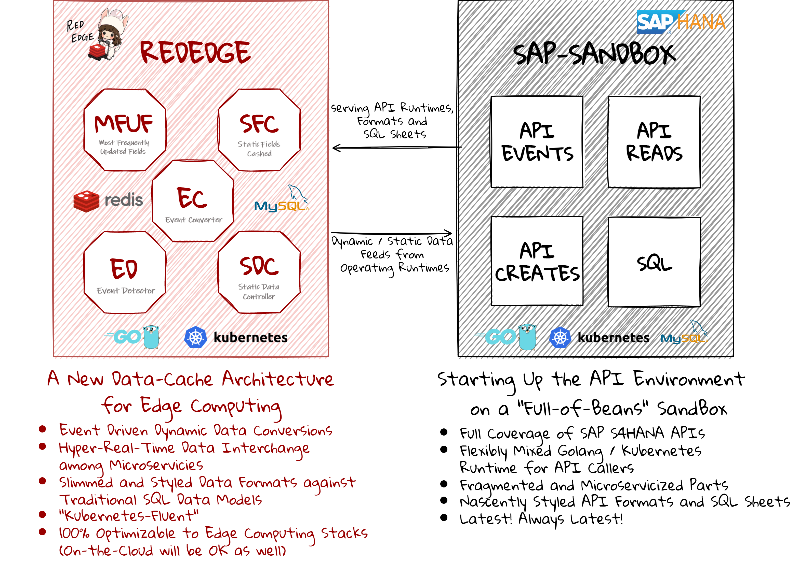

  
 
 Starting Up the API Environment on a "Full-of-Beans" SandBox 

***

# sap-sandbox  
sap-sandbox は、主にエッジコンピューティング環境において、外部システムをSAPと統合することを目的として作成されたリソースをまとめたリポジトリです。  
sap-sandbox の 「sandbox」は、Netflix 韓国ドラマ 「START-UP」 より、すべての開発者のための 地ならし になればという想いから命名されました。  
なお、各リポジトリのリソースは、そのままクラウド環境におけるアプリケーションにも適用可能です。  

## 前提条件  
sap-sandbox は、オンプレミス版である（＝クラウド版ではない）SAPS4HANA API の利用を前提としています。  
クラウド版APIを利用する場合は、ご注意ください。  

## Latona における SAP 領域・機能ごと の リソース整備状況    
下の図において、チェックマークが付いているリソースが、Latonaにおいて(少なくとも1次の)整備が行われたものであり、github上に公開されています。  

## 各リソースの所在  
各リソースの所在は、次の箇所です。  

### Central Functions  
##### EVENTS

* [sap-business-user-events](https://github.com/latonaio/sap-business-user-events)
* [sap-api-integrations-classification-events](https://github.com/latonaio/sap-api-integrations-classification-events)
* [sap-api-integrations-characteristic-events](https://github.com/latonaio/sap-api-integrations-characteristic-events)  
* [sap-api-integrations-business-partner-events](https://github.com/latonaio/sap-api-integrations-business-partner-events)

##### READS

* [sap-api-integrations-classification-reads](https://github.com/latonaio/sap-api-integrations-classification-reads)
* [sap-api-integrations-characteristic-reads](https://github.com/latonaio/sap-api-integrations-characteristic-reads)
* [sap-api-integrations-bank-master-reads](https://github.com/latonaio/sap-api-integrations-bank-master-reads)
* [sap-api-integrations-business-partner-reads](https://github.com/latonaio/sap-api-integrations-business-partner-reads)

##### CREATES

* [sap-api-integrations-business-partner-creates](https://github.com/latonaio/sap-api-integrations-business-partner-creates)

##### SQL

* [sap-classification-sql](https://github.com/latonaio/sap-classification-sql)
* [sap-characteristic-sql](https://github.com/latonaio/sap-characteristic-sql)
* [sap-bank-master-sql](https://github.com/latonaio/sap-bank-master-sql)
* [sap-business-partner-sql](https://github.com/latonaio/sap-business-partner-sql)

### Logistics  
##### EVENTS

* [sap-api-integrations-product-master-events](https://github.com/latonaio/sap-api-integrations-product-master-events)  
* [sap-api-integrations-batch-master-record-events](https://github.com/latonaio/sap-api-integrations-batch-master-record-events)

##### READS

* [sap-api-integrations-product-group-reads](https://github.com/latonaio/sap-api-integrations-product-group-reads)
* [sap-api-integrations-product-master-reads](https://github.com/latonaio/sap-api-integrations-product-master-reads) 
* [sap-api-integrations-product-master-class-reads](https://github.com/latonaio/sap-api-integrations-product-master-class-reads) 
* [sap-api-integrations-batch-master-record-reads](https://github.com/latonaio/sap-api-integrations-batch-master-record-reads)

##### CREATES

* [sap-api-integrations-product-master-creates](https://github.com/latonaio/sap-api-integrations-product-master-creates)

##### SQL

* [sap-product-group-sql](https://github.com/latonaio/sap-product-group-sql)  
* [sap-product-master-sql](https://github.com/latonaio/sap-product-master-sql)  
* [sap-product-master-class-sql](https://github.com/latonaio/sap--product-master-class-sql) 
* [sap-batch-master-record-sql](https://github.com/latonaio/sap-batch-master-record-sql)  

### Inventory Management  
##### EVENTS 

* [sap-api-integrations-inbound-delivery-events](https://github.com/latonaio/sap-api-integrations-inbound-delivery-events)  
* [sap-api-integrations-material-document-events](https://github.com/latonaio/sap-api-integrations-material-document-events)  

##### READS

* [sap-api-integrations-material-stock-reads](https://github.com/latonaio/sap-api-integrations-material-stock-reads)
* [sap-api-integrations-reservation-document-reads](https://github.com/latonaio/sap-api-integrations-reservation-document-reads) 
* [sap-api-integrations-inbound-delivery-reads](https://github.com/latonaio/sap-api-integrations-inbound-delivery-reads)
* [sap-api-integrations-material-document-reads](https://github.com/latonaio/sap-api-integrations-material-document-reads)  
* [sap-api-integrations-physical-inventory-document-reads](https://github.com/latonaio/sap-api-integrations-physical-inventory-document-reads)  
* [sap-api-integrations-warehouse-resource-reads](https://github.com/latonaio/sap-api-integrations-warehouse-resource-reads)  
* [sap-api-integrations-warehouse-available-stock-reads](https://github.com/latonaio/sap-api-integrations-warehouse-available-stock-reads)  

##### CREATES

* [sap-api-integrations-inbound-delivery-creates](https://github.com/latonaio/sap-api-integrations-inbound-delivery-creates)
* [sap-api-integrations-material-document-creates](https://github.com/latonaio/sap-api-integrations-material-document-creates)

##### SQL

* [sap-material-stock-sql](https://github.com/latonaio/sap-material-stock-sql)  
* [sap-reservation-document-sql](https://github.com/latonaio/sap-reservation-document-sql)  
* [sap-inbound-delivery-sql](https://github.com/latonaio/sap-inbound-delivery-sql)
* [sap-material-document-sql](https://github.com/latonaio/sap-material-document-sql)
* [sap-physical-inventory-document-sql](https://github.com/latonaio/sap-physical-inventory-document-sql)
* [sap-warehouse-resource-sql](https://github.com/latonaio/sap-warehouse-resource-sql)
* [sap-warehouse-available-stock-sql](https://github.com/latonaio/sap-warehouse-available-stock-sql)  

### Sales Management
##### EVENTS

* [sap-api-integrations-business-partner-events](https://github.com/latonaio/sap-api-integrations-business-partner-events)
* [sap-api-integrations-customer-material-events](https://github.com/latonaio/sap-api-integrations-customer-material-events)
* [sap-api-integrations-sales-pricing-events](https://github.com/latonaio/sap-api-integrations-sales-pricing-events)
* [sap-api-integrations-sales-inquiry-events](https://github.com/latonaio/sap-api-integrations-sales-inquiry-events)
* [sap-api-integrations-sales-quotation-events](https://github.com/latonaio/sap-api-integrations-sales-quotation-events)
* [sap-api-integrations-sales-order-events](https://github.com/latonaio/sap-api-integrations-sales-order-events)  
* [sap-api-integrations-sales-contract-events](https://github.com/latonaio/sap-api-integrations-sales-contract-events)
* [sap-api-integrations-sales-scheduling-agreement-events](https://github.com/latonaio/sap-api-integrations-sales-scheduling-agreement-events)
* [sap-api-integrations-outbound-delivery-events](https://github.com/latonaio/sap-api-integrations-outbound-delivery-events) 
* [sap-api-integrations-customer-return-events](https://github.com/latonaio/sap-api-integrations-customer-return-events)  
* [sap-api-integrations-billing-document-events](https://github.com/latonaio/sap-api-integrations-billing-document-events)  
* [sap-api-integrations-credit-memo-request-events](https://github.com/latonaio/sap-api-integrations-credit-memo-request-events)
* [sap-api-integrations-debit-memo-request-events](https://github.com/latonaio/sap-api-integrations-debit-memo-request-events)

##### READS

* [sap-api-integrations-business-partner-reads-customer](https://github.com/latonaio/sap-api-integrations-business-partner-reads-customer)  
* [sap-api-integrations-credit-management-master-reads](https://github.com/latonaio/sap-api-integrations-credit-management-master-reads)  
* [sap-api-integrations-customer-material-reads](https://github.com/latonaio/sap-api-integrations-customer-material-reads)  
* [sap-api-integrations-sales-pricing-reads](https://github.com/latonaio/sap-api-integrations-sales-pricing-reads)
* [sap-api-integrations-sales-inquiry-reads](https://github.com/latonaio/sap-api-integrations-sales-inquiry-reads)
* [sap-api-integrations-sales-quotation-reads](https://github.com/latonaio/sap-api-integrations-sales-quotation-reads)
* [sap-api-integrations-sales-order-reads](https://github.com/latonaio/sap-api-integrations-sales-order-reads)
* [sap-api-integrations-sales-contract-reads](https://github.com/latonaio/sap-api-integrations-sales-contract-reads)
* [sap-api-integrations-sales-scheduling-agreement-reads](https://github.com/latonaio/sap-api-integrations-sales-scheduling-agreement-reads)
* [sap-api-integrations-outbound-delivery-reads](https://github.com/latonaio/sap-api-integrations-outbound-delivery-reads) 
* [sap-api-integrations-customer-return-reads](https://github.com/latonaio/sap-api-integrations-customer-return-reads)  
* [sap-api-integrations-billing-document-reads](https://github.com/latonaio/sap-api-integrations-billing-document-reads)
* [sap-api-integrations-credit-memo-request-reads](https://github.com/latonaio/sap-api-integrations-credit-memo-request-reads)
* [sap-api-integrations-debit-memo-request-reads](https://github.com/latonaio/sap-api-integrations-debit-memo-request-reads)

##### CREATES

* [sap-api-integrations-business-partner-creates-customer](https://github.com/latonaio/sap-api-integrations-business-partner-creates-customer)
* [sap-api-integrations-customer-material-creates](https://github.com/latonaio/sap-api-integrations-customer-material-creates)
* [sap-api-integrations-sales-quotation-creates](https://github.com/latonaio/sap-api-integrations-sales-quotation-creates)  
* [sap-api-integrations-sales-order-creates](https://github.com/latonaio/sap-api-integrations-sales-order-creates)  
* [sap-api-integrations-sales-contract-creates](https://github.com/latonaio/sap-api-integrations-sales-contract-creates)
* [sap-api-integrations-outbound-delivery-creates](https://github.com/latonaio/sap-api-integrations-outbound-delivery-creates) 
* [sap-api-integrations-customer-return-creates](https://github.com/latonaio/sap-api-integrations-customer-return-creates) 
* [sap-api-integrations-billing-document-creates](https://github.com/latonaio/sap-api-integrations-billing-document-creates) 
* [sap-api-integrations-credit-memo-request-creates](https://github.com/latonaio/sap-api-integrations-credit-memo-request-creates)

##### SQL

* [sap-business-partner-sql](https://github.com/latonaio/sap-business-partner-sql)  
* [sap-credit-management-master-sql](https://github.com/latonaio/sap-credit-management-master-sql)
* [sap-customer-material-sql](https://github.com/latonaio/sap-customer-material-sql)  
* [sap-sales-pricing-sql](https://github.com/latonaio/sap-sales-pricing-sql)  
* [sap-sales-inquiry-sql](https://github.com/latonaio/sap-sales-inquiry-sql)
* [sap-sales-quotation-sql](https://github.com/latonaio/sap-sales-quotation-sql)
* [sap-sales-order-sql](https://github.com/latonaio/sap-sales-order-sql)  
* [sap-sales-contract-sql](https://github.com/latonaio/sap-sales-contract-sql)
* [sap-sales-scheduling-agreement-sql](https://github.com/latonaio/sap-sales-scheduling-agreement-sql)
* [sap-outbound-delivery-sql](https://github.com/latonaio/sap-outbound-delivery-sql)  
* [sap-customer-return-sql](https://github.com/latonaio/sap-customer-return-sql)  
* [sap-billing-document-sql](https://github.com/latonaio/sap-billing-document-sql)  
* [sap-credit-memo-request-sql](https://github.com/latonaio/sap-credit-memo-request-sql)
* [sap-debit-memo-request-sql](https://github.com/latonaio/sap-debit-memo-request-sql)

### Procurement Management  
##### EVENTS

* [sap-api-integrations-business-partner-events](https://github.com/latonaio/sap-api-integrations-business-partner-events)  
* [sap-api-integrations-purchasing-info-record-events](https://github.com/latonaio/sap-api-integrations-purchasing-info-record-events)  
* [sap-api-integrations-purchase-requisition-events](https://github.com/latonaio/sap-api-integrations-purchase-requisition-events) 
* [sap-api-integrations-purchase-order-events](https://github.com/latonaio/sap-api-integrations-purchase-order-events)  
* [sap-api-integrations-purchase-contract-events](https://github.com/latonaio/sap-api-integrations-purchase-contract-events)
* [sap-api-integrations-purchase-scheduling-agreement-events](https://github.com/latonaio/sap-api-integrations-purchase-scheduling-agreement-events)
* [sap-api-integrations-supplier-invoice-events](https://github.com/latonaio/sap-api-integrations-supplier-invoice-events)

##### READS

* [sap-api-integrations-business-partner-reads-supplier](https://github.com/latonaio/sap-api-integrations-business-partner-reads-supplier)  
* [sap-api-integrations-purchasing-source-list-reads](https://github.com/latonaio/sap-api-integrations-purchasing-source-list-reads)  
* [sap-api-integrations-purchasing-info-record-reads](https://github.com/latonaio/sap-api-integrations-purchasing-info-record-reads)  
* [sap-api-integrations-purchase-requisition-reads](https://github.com/latonaio/sap-api-integrations-purchase-requisition-reads)
* [sap-api-integrations-purchase-order-reads](https://github.com/latonaio/sap-api-integrations-purchase-order-reads)  
* [sap-api-integrations-purchase-contract-reads](https://github.com/latonaio/sap-api-integrations-purchase-contract-reads)
* [sap-api-integrations-purchase-scheduling-agreement-reads](https://github.com/latonaio/sap-api-integrations-purchase-scheduling-agreement-reads)
* [sap-api-integrations-supplier-invoice-reads](https://github.com/latonaio/sap-api-integrations-supplier-invoice-reads)

##### CREATES

* [sap-api-integrations-purchasing-info-record-creates](https://github.com/latonaio/sap-api-integrations-purchasing-info-record-creates)  
* [sap-api-integrations-supplier-quotation-creates](https://github.com/latonaio/sap-api-integrations-supplier-quotation-creates)  
* [sap-api-integrations-purchase-requisition-creates](https://github.com/latonaio/sap-api-integrations-purchase-requisition-creates)

##### SQL  

* [sap-business-partner-sql](https://github.com/latonaio/sap-business-partner-sql)
* [sap-purchasing-source-list-sql](https://github.com/latonaio/sap-purchasing-source-list-sql)  
* [sap-purchasing-info-record-sql](https://github.com/latonaio/sap-purchasing-info-record-sql) 
* [sap-purchase-requisition-sql](https://github.com/latonaio/sap-purchase-requisition-sql) 
* [sap-purchase-order-sql](https://github.com/latonaio/sap-purchase-order-sql)
* [sap-purchase-contract-sql](https://github.com/latonaio/sap-purchase-contract-sql)
* [sap-purchase-scheduling-agreement-sql](https://github.com/latonaio/sap-purchase-scheduling-agreement-sql)
* [sap-supplier-invoice-sql](https://github.com/latonaio/sap-supplier-invoice-sql)

### Production Management  
##### EVENTS

* [sap-api-integrations-bill-of-material-events](https://github.com/latonaio/sap-api-integrations-bill-of-material-events)  
* [sap-api-integrations-work-center-events](https://github.com/latonaio/sap-api-integrations-work-center-events) 
* [sap-api-integrations-production-order-events](https://github.com/latonaio/sap-api-integrations-production-order-events)  

##### READS

* [sap-api-integrations-bill-of-material-reads](https://github.com/latonaio/sap-api-integrations-bill-of-material-reads)  
* [sap-api-integrations-bill-of-material-where-used-list-reads](https://github.com/latonaio/sap-api-integrations-bill-of-material-where-used-list-reads)  
* [sap-api-integrations-work-center-reads](https://github.com/latonaio/sap-api-integrations-work-center-reads)
* [sap-api-integrations-production-routing-reads](https://github.com/latonaio/sap-api-integrations-production-routing-reads)   
* [sap-api-integrations-planned-independent-requirement-reads](https://github.com/latonaio/sap-api-integrations-planned-independent-requirement-reads)  
* [sap-api-integrations-material-planning-data-reads](https://github.com/latonaio/sap-api-integrations-material-planning-data-reads)   
* [sap-api-integrations-planned-order-reads](https://github.com/latonaio/sap-api-integrations-planned-order-reads)  
* [sap-api-integrations-production-order-reads](https://github.com/latonaio/sap-api-integrations-production-order-reads)  
* [sap-api-integrations-production-order-confirmation-reads](https://github.com/latonaio/sap-api-integrations-production-order-confirmation-reads)   

##### CREATES

* [sap-api-integrations-bill-of-material-creates](https://github.com/latonaio/sap-api-integrations-bill-of-material-creates)  
* [sap-api-integrations-process-routing-creates](https://github.com/latonaio/sap-api-integrations-process-routing-creates)
* [sap-api-integrations-production-order-creates](https://github.com/latonaio/sap-api-integrations-production-order-creates)  

##### SQL 

* [sap-bill-of-material-sql](https://github.com/latonaio/sap-bill-of-material-sql)  
* [sap-bill-of-material-where-used-list-sql](https://github.com/latonaio/sap-bill-of-material-sql)  
* [sap-work-center-sql](https://github.com/latonaio/sap-work-center-sql)  
* [sap-production-routing-sql](https://github.com/latonaio/sap-production-routing-sql)  
* [sap-planned-independent-requirement-sql](https://github.com/latonaio/sap-planned-independent-requirement-sql)
* [sap-material-planning-data-sql](https://github.com/latonaio/sap-material-planning-data-sql)    
* [sap-planned-order-sql](https://github.com/latonaio/sap-planned-order-sql)
* [sap-production-order-sql](https://github.com/latonaio/sap-production-order-sql)   
* [sap-production-order-confirmation-sql](https://github.com/latonaio/sap-production-order-confirmation-sql)   

### Process Management  
##### EVENTS

* [sap-api-integrations-process-order-events](https://github.com/latonaio/sap-api-integrations-process-order-events)

##### READS

* [sap-api-integrations-master-recipe-reads](https://github.com/latonaio/sap-api-integrations-master-recipe-reads)
* [sap-api-integrations-process-order-reads](https://github.com/latonaio/sap-api-integrations-process-order-reads)
* [sap-api-integrations-process-order-confirmation-reads](https://github.com/latonaio/sap-api-integrations-process-order-confirmation-reads)

##### CREATES
* [sap-api-integrations-process-order-creates](https://github.com/latonaio/sap-api-integrations-process-order-creates)

##### SQL

* [sap-master-recipe-sql](https://github.com/latonaio/sap-master-recipe-sql)
* [sap-process-order-sql](https://github.com/latonaio/sap-process-order-sql)
* [sap-process-order-confirmation-sql](https://github.com/latonaio/sap-process-order-confirmation-sql)

### Quality Management  
##### EVENTS

* [sap-api-integrations-inspection-plan-events](https://github.com/latonaio/sap-api-integrations-inspection-plan-events)

##### READS

* [sap-api-integrations-inspection-plan-reads](https://github.com/latonaio/sap-api-integrations-inspection-plan-reads)
* [sap-api-integrations-quality-info-record-reads](https://github.com/latonaio/sap-api-integrations-quality-info-record-reads)

##### SQL

* [sap-inspection-plan-sql](https://github.com/latonaio/sap-inspection-plan-sql)
* [sap-quality-info-record-sql](https://github.com/latonaio/sap-quality-info-record-sql)

### Plant Maintenance  
##### EVENTS

* [sap-api-integrations-functional-location-events](https://github.com/latonaio/sap-api-integrations-functional-location-events)
* [sap-api-integrations-equipment-master-events](https://github.com/latonaio/sap-api-integrations-equipment-master-events) 
* [sap-api-integrations-maintenance-bill-of-material-events](https://github.com/latonaio/sap-api-integrations-maintenance-bill-of-material-events)
* [sap-api-integrations-maintenance-notification-events](https://github.com/latonaio/sap-api-integrations-maintenance-notification-events)
* [sap-api-integrations-maintenance-order-confirmation-events](https://github.com/latonaio/sap-api-integrations-maintenance-order-confirmation-events)
* [sap-api-integrations-maintenance-task-list-events](https://github.com/latonaio/sap-api-integrations-maintenance-task-list-events)
* [sap-api-integrations-measuring-point-events](https://github.com/latonaio/sap-api-integrations-measuring-point-events)
* [sap-api-integrations-measurement-document-events](https://github.com/latonaio/sap-api-integrations-measurement-document-events)

##### READS

* [sap-api-integrations-functional-location-reads](https://github.com/latonaio/sap-api-integrations-functional-location-reads)
* [sap-api-integrations-equipment-master-reads](https://github.com/latonaio/sap-api-integrations-equipment-master-reads)
* [sap-api-integrations-maintenance-bill-of-material-reads](https://github.com/latonaio/sap-api-integrations-maintenance-bill-of-material-reads)
* [sap-api-integrations-maintenance-plan-reads](https://github.com/latonaio/sap-api-integrations-maintenance-plan-reads)
* [sap-api-integrations-maintenance-item-reads](https://github.com/latonaio/sap-api-integrations-maintenance-item-reads)
* [sap-api-integrations-maintenance-notification-reads](https://github.com/latonaio/sap-api-integrations-maintenance-notification-reads)
* [sap-api-integrations-maintenance-order-reads](https://github.com/latonaio/sap-api-integrations-maintenance-order-reads)
* [sap-api-integrations-maintenance-order-confirmation-reads](https://github.com/latonaio/sap-api-integrations-maintenance-order-confirmation-reads)
* [sap-api-integrations-defect-reads](https://github.com/latonaio/sap-api-integrations-defect-reads)
* [sap-api-integrations-maintenance-task-list-reads](https://github.com/latonaio/sap-api-integrations-maintenance-task-list-reads)
* [sap-api-integrations-measuring-point-reads](https://github.com/latonaio/sap-api-integrations-measuring-point-reads)
* [sap-api-integrations-measurement-document-reads](https://github.com/latonaio/sap-api-integrations-measurement-document-reads)

##### CREATES

* [sap-api-integrations-functional-location-creates](https://github.com/latonaio/sap-api-integrations-functional-location-creates)
* [sap-api-integrations-equipment-master-creates](https://github.com/latonaio/sap-api-integrations-equipment-master-creates)
* [sap-api-integrations-maintenance-plan-creats](https://github.com/latonaio/sap-api-integrations-maintenance-plan-creates)
* [sap-api-integrations-maintenance-item-creates](https://github.com/latonaio/sap-api-integrations-maintenance-item-creates)
* [sap-api-integrations-maintenance-notification-creates](https://github.com/latonaio/sap-api-integrations-maintenance-notification-creates)
* [sap-api-integrations-maintenance-order-confirmation-creates](https://github.com/latonaio/sap-api-integrations-maintenance-order-confirmation-creates)
* [sap-api-integrations-defect-creates](https://github.com/latonaio/sap-api-integrations-defect-creates)

##### SQL 

* [sap-functional-location-sql](https://github.com/latonaio/sap-functional-location-sql)
* [sap-equipment-master-sql](https://github.com/latonaio/sap-equipment-master-sql)  
* [sap-equipment-hierarchy-sql](https://github.com/latonaio/sap-equipment-hierarchy-sql)  
* [sap-maintenance-bill-of-material-sql](https://github.com/latonaio/sap-maintenance-bill-of-material-sql)
* [sap-maintenance-plan-sql](https://github.com/latonaio/sap-maintenance-plan-sql)
* [sap-maintenance-item-sql](https://github.com/latonaio/sap-maintenance-item-sql)
* [sap-maintenance-notification-sql](https://github.com/latonaio/sap-maintenance-order-confirmation-sql)
* [sap-maintenance-order-sql](https://github.com/latonaio/sap-maintenance-order-sql)
* [sap-maintenance-order-confirmation-sql](https://github.com/latonaio/sap-maintenance-order-confirmation-sql)
* [sap-defect-sql](https://github.com/latonaio/sap-defect-sql)
* [sap-maintenance-task-list-sql](https://github.com/latonaio/sap-maintenance-task-list-sql)
* [sap-measuring-point-sql](https://github.com/latonaio/sap-measuring-point-sql)
* [sap-measurement-document-sql](https://github.com/latonaio/sap-measurement-document-sql)

### Customer Service
##### EVENTS

* [sap-api-integrations-service-order-events](https://github.com/latonaio/sap-api-integrations-service-order-events)
* [sap-api-integrations-service-confirmation-events](https://github.com/latonaio/sap-api-integrations-service-confirmation-events)

##### READS

* [sap-api-integrations-service-order-reads](https://github.com/latonaio/sap-api-integrations-service-order-reads)
* [sap-api-integrations-service-confirmation-reads](https://github.com/latonaio/sap-api-integrations-service-confirmation-reads)

##### SQL

* [sap-service-order-sql](https://github.com/latonaio/sap-service-order-sql)
* [sap-service-confirmation-sql](https://github.com/latonaio/sap-service-confirmation-sql)

## sap-sandbox における SAP領域・機能 の選択基準
sap-sandbox におけるSAP領域・機能は、SAP S4HANA のあらゆる領域・機能のうち、世界中の企業で繰り返し利用され、利用頻度が高いと判断されるものが、選択されています。  

## SQL 作成の基準
sap-sandbox において ある機能 に対して SQL を 作成するかどうか は、次の基準に基づいて判断されています。  

* 外部システム側で当該機能の必要十分なデータ量を保持する要求が、平均的にあるかどうか  
* 当該機能の平均的要求に、外部システムから帳票を出力することが含まれるかどうか  

上記基準のいずれかに当てはまれば、sap-sandbox において SQL が作成され、該当するレポジトリが存在します。  
なお、SAP API Business Hub にて READ API が公開されていない機能については、sap-sandbox において SQL は作成されません。  

## Rededgeとの依存関係  
以下の図は、sap-sandbox と [rededge](https://github.com/latonaio/rededge) との依存関係を示した図です。（sap-sandbox は マイクロサービス であり、rededge と独立して動作します。rededge と組み合わせないと機能しないということではありません）    
SAP-SANDBOX は、REDEDGE との統合に関連して、以下の機能を提供します。  

* Full Coverage of SAP S4HANA APIs（SAP S4HANA API の完全なカバレッジ）    
* Frexibly Mixed Golang / Kubernetes Runtime for API Callers（API Caller のための フレキシブルに組み合わせ可能な Golang / Kubernetes ランタイム）   
* Fragmented and Microservicized Parts（細かく刻まれマイクロサービス化された部品）  
* Nascently Styled API Formats and SQL Sheets（新生にスタイルされた APIフォーマット と SQLシート）  
* Latest! Always Latest!（リソースは常に最新の状態です！）  

  
